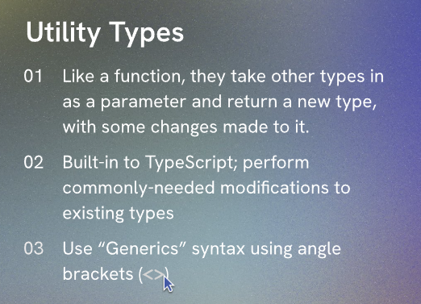

# Typescript Concepts

- [Custom Types](custom-types.ts)
- [Nested Object Types](nested-object-types.ts)
- [Optional Properties](optional-properties.ts)
- [Typing Arrays](typing-arrays.ts)
- [Literal Types](literal-types.ts)
- [UNIONS](unions.ts)
- [Function Return Types](function-return-types.ts)
- [Utility Types - Partial<> included](utility-types.ts): TypeScript provides several utility types to facilitate common type transformations. These utilities are available globally.

- [Omit<> Utility Type](omit.ts)